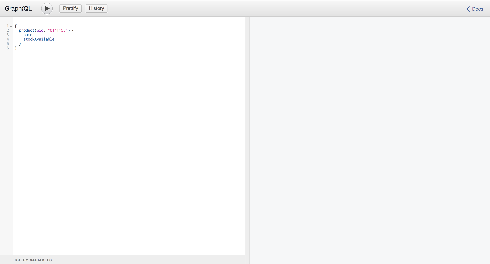

# Experiment GraphQL

repository ตัวอย่างสำหรับ graphql โดยจำลองการ query product ด้วย pid ซึ่งไปหา product จาก `ProductService` (จำลองว่าเรามี service ทำจัดการเรื่อง Product อยู่) และ `InventoryService` (จำลองว่าเรามี service สำหรับจัดการ inventory ของ pid ต่างๆ)

# วิธีรัน

```bash
$ yarn install
$ node app.js
```

เข้า web browser ด้วย `http://localhost:3000/graphql` จะเจอหน้าให้ graphql query ขึ้นตามรูปด้านล่าง


